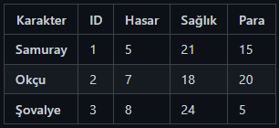
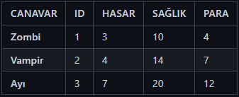
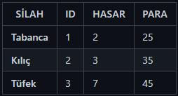
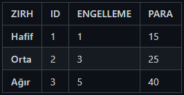
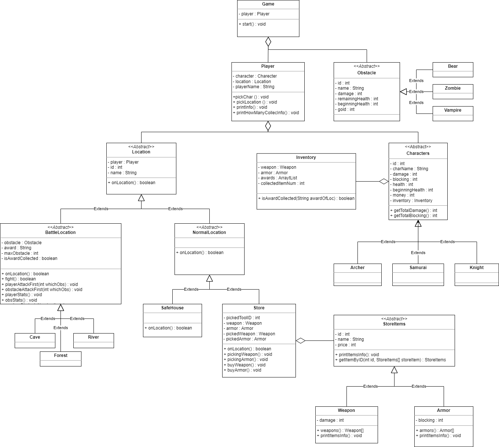

# Adventure Game

A text-based adventure game made in Java.

## Purpose Of The Game
Collecting all items at battle locations, fighting various obstacles while doing so.

## What can the player do:
- The player first chooses a character by looking at their attributes such as health, damage power, how much money they have and etc. 
- Travel between locations with that character. 
- Fights monsters where he/she goes to collect items. 
- May die while fighting. 
- Can go to the store and buy items for battles. 
- Can go to the safe house and restored his health. 
- If he/she collects all the items, wins the game.

### CHARACTERS

### OBSTACLES

### WEAPONS

### ARMORS

## **LOCATIONS**

### Safe House

- Feature : Life Regenerating

### Cave

- Obstacle Zombie (1-3)
- Feature : War + Loot
- Item : Food

### Forest

- Obstacle : Vampire (1-3)
- Feature : War + Loot
- Item : Firewood

### River

- Obstacle : Bear (1-3)
- Feature : War + Loot
- Item : Water

### Store

- Feature : Buying Supporting Items
- Weapon : Gun, Sword, Rifle
- Armor : Light, Medium, Heavy

## Sınıf Diyagramı

