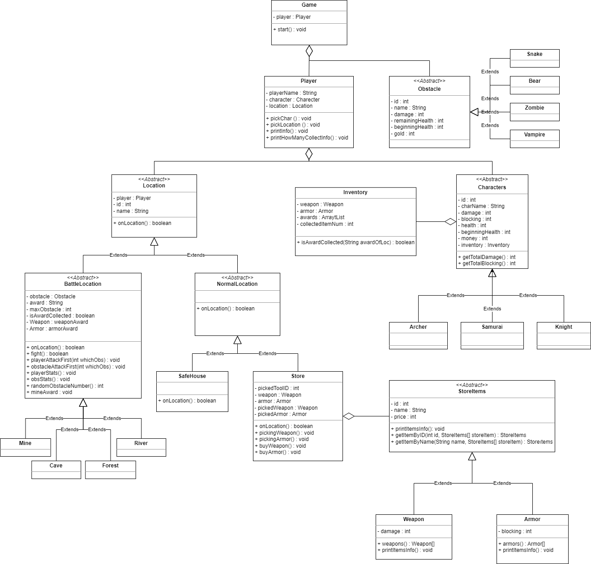

# Adventure Game

A text-based adventure game made in Java.

## Purpose Of The Game
Collecting all items at battle locations, fighting various obstacles while doing so.

## What can the player do:
- The player first chooses a character by looking at their attributes such as health, damage power, how much money they have and etc. 
- Travel between locations with that character. 
- Fights monsters where he/she goes to collect items. 
- May die while fighting. 
- If he/she wins the fight, wins both the item in that location and the prize money.
- Can go to the store and buy items for battles. 
- Can go to the safe house and restored his health. 
- If he/she collects all the items, wins the game.

### CHARACTERS

| Character | ID  | Damage | Health | Money |
|:----------|:---:|:------:|:------:|:-----:|
| Samurai   |  1  |   5    |   21   |  15   |
| Archer    |  2  |   7    |   18   |  20   |
| Knight    |  3  |   8    |   24   |   5   |

### OBSTACLES

| Obstacle | ID  | Damage | Health |    Money    |
|:---------|:---:|:------:|:------:|:-----------:|
| Zombie   |  1  |   3    |   10   |      4      |
| Vampire  |  2  |   4    |   14   |      7      |
| Bear     |  3  |   7    |   20   |     12      |
| Snake    |  4  |  3-6   |   12   | random item |

### WEAPONS

| Weapon | ID  | Damage | Money |
|:-------|:---:|:------:|:-----:|
| Gun    |  1  |   2    |  25   |
| Sword  |  2  |   3    |  35   |
| Rifle  |  3  |   7    |  45   |

### ARMORS

| Armor  | ID  | Damage | Money |
|:-------|:---:|:------:|:-----:|
| Light  |  1  |   1    |  15   |
| Medium |  2  |   3    |  25   |
| Heavy  |  3  |   5    |  40   |

## **LOCATIONS**

### Safe House

- Feature : Life Regenerating

### Cave

- Obstacle Zombie (1-3)
- Feature : War + Loot
- Item : Food

### Forest

- Obstacle : Vampire (1-3)
- Feature : War + Loot
- Item : Firewood

### River

- Obstacle : Bear (1-3)
- Feature : War + Loot
- Item : Water

### Mine

- Obstacle : Snake (1-5)
- Feature: War + Loot
- Item: Random
1. Money(25%) 
   1. 10(20%)
   2. 5(30%)
   3. 1(50%)
2. Weapon(15%)
   1. Rifle(20%)
   2. Sword(30%)
   3. Gun(50%) 
3. Armor(15%)
   1. Heavy armor(20%)
   2. Medium armor(30%)
   3. Light armor(50%)
4. Nothing(45%) 
### Store

- Feature : Buying Supporting Items
- Weapon : Gun, Sword, Rifle
- Armor : Light, Medium, Heavy

## UML Diagram

